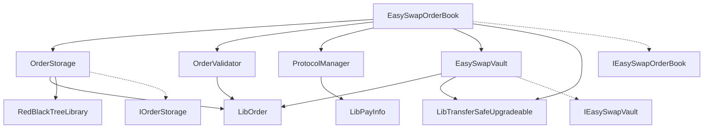
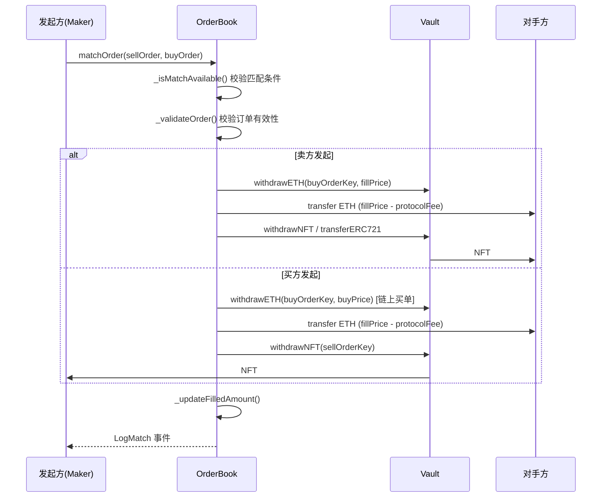

# EasySwap NFT 市场 — 概要设计

## 1. 文档信息

| 项目 | 内容 |
|------|------|
| 项目名称 | EasySwap NFT 去中心化交易市场 |
| 文档版本 | v1.0 |
| 编写依据 | `contracts/` 目录下 Solidity 智能合约源码 |
| 对应文档 | 01.需求规格说明书.md |

---

## 2. 系统架构

### 2.1 总体架构

系统采用「订单簿 + 资产托管」双合约架构，通过多重继承将订单簿合约拆分为职责清晰的模块：

```
┌─────────────────────────────────────────────────────────────┐
│                    EasySwapOrderBook                         │
│  ┌──────────────┐ ┌──────────────┐ ┌───────────────────┐  │
│  │ OrderStorage │ │OrderValidator│ │ ProtocolManager   │  │
│  │  订单簿存储   │ │  订单校验     │ │  协议费率管理      │  │
│  └──────────────┘ └──────────────┘ └───────────────────┘  │
│  ┌──────────────────────────────────────────────────────┐   │
│  │              交易逻辑（make/cancel/edit/match）         │   │
│  └──────────────────────────────────────────────────────┘   │
└──────────────────────────┬──────────────────────────────────┘
                           │ onlyEasySwapOrderBook
                           ▼
              ┌────────────────────────┐
              │     EasySwapVault       │
              │   ETH / NFT 资产托管     │
              └────────────────────────┘
                           │
                           ▼
              ┌────────────────────────┐
              │   外部 ERC721 合约      │
              └────────────────────────┘
```

### 2.2 部署架构

```
┌──────────────────┐     ┌──────────────────────────┐
│   Proxy Admin    │────▶│  EasySwapOrderBook Proxy  │
└──────────────────┘     └────────────┬─────────────┘
                                      │ delegatecall
                                      ▼
                           ┌──────────────────────┐
                           │ OrderBook Implementation│
                           └──────────────────────┘

┌──────────────────┐     ┌──────────────────────────┐
│   Proxy Admin    │────▶│   EasySwapVault Proxy     │
└──────────────────┘     └────────────┬─────────────┘
                                      │ delegatecall
                                      ▼
                           ┌──────────────────────┐
                           │  Vault Implementation   │
                           └──────────────────────┘
```

- 两个核心合约均通过 OpenZeppelin Upgradeable Proxy 模式部署
- OrderBook 初始化参数：protocolShare、vault 地址、EIP712 名称与版本
- Vault 初始化后需通过 setOrderBook 绑定 OrderBook 地址

---

## 3. 模块划分

### 3.1 模块总览

| 模块 | 合约/库 | 职责 |
|------|---------|------|
| 交易入口 | EasySwapOrderBook | 对外 API、交易流程编排、事件发射 |
| 订单存储 | OrderStorage | 订单簿数据结构、红黑树价格索引、订单 CRUD |
| 订单校验 | OrderValidator | 订单有效性校验、成交/取消状态管理 |
| 协议管理 | ProtocolManager | 协议费率配置与校验 |
| 资产托管 | EasySwapVault | ETH/NFT 托管、按 orderKey 隔离资产 |
| 订单库 | LibOrder | 订单数据结构、哈希计算、辅助判断 |
| 支付库 | LibPayInfo | 协议费率常量、PayInfo 结构 |
| 价格索引库 | RedBlackTreeLibrary | 红黑树实现，Price 类型封装 |
| 安全转账库 | LibTransferSafeUpgradeable | ETH/ERC20/ERC721 安全转移 |
| 接口层 | IEasySwapOrderBook / IEasySwapVault / IOrderStorage | 合约对外接口定义 |

### 3.2 模块依赖关系



---

## 4. 核心设计

### 4.1 订单簿模型

订单簿按 **NFT 集合地址（collection）** 和 **订单方向（side）** 两个维度组织：

```
priceTrees[collection][side]  →  RedBlackTree（价格索引）
orderQueues[collection][side][price]  →  OrderQueue（同价 FIFO 队列）
orders[orderKey]  →  DBOrder（订单数据 + 链表 next 指针）
```

**价格排序策略：**

| Side | 最优价获取 | 遍历方向 | 含义 |
|------|-----------|----------|------|
| List（卖） | first() | next() 递增 | 最低价优先 |
| Bid（买） | last() | prev() 递减 | 最高价优先 |

**同价位订单排队：** 使用单向链表（head → ... → tail），新订单追加到 tail，保证 FIFO 顺序。

### 4.2 资产托管模型

Vault 以 OrderKey 为索引隔离资产：

```
ETHBalance[orderKey]  →  买单锁定的 ETH 数量
NFTBalance[orderKey]  →  卖单锁定的 tokenId
```

资产流转仅通过 OrderBook 调用 Vault 接口完成，用户不直接与 Vault 交互（batchTransferERC721 除外）。

### 4.3 订单生命周期

```
                    ┌──────────┐
                    │  创建订单  │
                    └────┬─────┘
                         │
              ┌──────────┼──────────┐
              ▼          ▼          ▼
         ┌────────┐ ┌────────┐ ┌────────┐
         │  活跃   │ │  修改   │ │  取消   │
         └───┬────┘ └───┬────┘ └───┬────┘
             │          │          │
             │     旧订单取消       │
             │     新订单创建       │
             │          │          ▼
             │          │    filledAmount
             │          │    = CANCELLED
             ▼          ▼
         ┌─────────────────┐
         │     撮合成交      │
         └────────┬────────┘
                  │
                  ▼
         filledAmount 更新
         （完全成交或部分成交）
```

### 4.4 撮合流程设计



### 4.5 批量操作容错设计

批量创建/取消/修改采用 **Try 模式**：单笔失败跳过并记录事件，不影响同批次其他操作。

批量撮合采用 **Delegatecall 隔离**：通过 `matchOrderWithoutPayback` 在独立上下文中执行，单笔 revert 被捕获并通过 `BatchMatchInnerError` 上报，整批继续执行。

---

## 5. 接口设计概要

### 5.1 EasySwapOrderBook 对外接口

| 函数 | 类型 | 说明 |
|------|------|------|
| makeOrders | write, payable | 批量创建订单 |
| cancelOrders | write | 批量取消订单 |
| editOrders | write, payable | 批量修改订单 |
| matchOrder | write, payable | 单笔撮合 |
| matchOrders | write, payable | 批量撮合 |
| getBestOrder | view | 查询最优订单 |
| getOrders | view | 分页查询订单 |
| setVault | write, onlyOwner | 设置 Vault 地址 |
| setProtocolShare | write, onlyOwner | 设置协议费率 |
| pause / unpause | write, onlyOwner | 暂停/恢复 |
| withdrawETH | write, onlyOwner | 提取合约 ETH |

### 5.2 EasySwapVault 对外接口

| 函数 | 类型 | 调用者 |
|------|------|--------|
| depositETH / withdrawETH / editETH | write, payable | OrderBook |
| depositNFT / withdrawNFT / editNFT | write | OrderBook |
| transferERC721 | write | OrderBook |
| batchTransferERC721 | write | 任意用户 |
| balanceOf | view | 任意 |
| setOrderBook | write, onlyOwner | Owner |

---

## 6. 数据结构设计概要

### 6.1 核心枚举

```solidity
enum Side { List, Bid }
enum SaleKind { FixedPriceForCollection, FixedPriceForItem }
```

### 6.2 核心结构体

```solidity
struct Order {
    Side side;
    SaleKind saleKind;
    address maker;
    Asset nft;       // { tokenId, collection, amount }
    Price price;     // uint128 封装
    uint64 expiry;
    uint64 salt;
}

struct DBOrder {
    Order order;
    OrderKey next;   // 同价位链表指针
}

struct OrderQueue {
    OrderKey head;
    OrderKey tail;
}
```

### 6.3 关键映射

| 映射 | 用途 |
|------|------|
| orders[OrderKey] → DBOrder | 订单主存储 |
| priceTrees[collection][side] → Tree | 价格红黑树 |
| orderQueues[collection][side][price] → OrderQueue | 同价订单队列 |
| filledAmount[OrderKey] → uint256 | 成交/取消状态 |
| ETHBalance[OrderKey] → uint256 | Vault ETH 余额 |
| NFTBalance[OrderKey] → uint256 | Vault NFT tokenId |

---

## 7. 安全设计

### 7.1 访问控制

| 层级 | 机制 | 范围 |
|------|------|------|
| Owner 权限 | OwnableUpgradeable | 费率、Vault、暂停、提款 |
| OrderBook 权限 | onlyEasySwapOrderBook | Vault 资产操作 |
| 用户权限 | maker == msg.sender | 创建/取消/修改订单 |
| 撮合权限 | msg.sender == sell/buy maker | 撮合发起 |

### 7.2 防护机制

- **ReentrancyGuard**：所有外部 write 函数
- **Pausable**：交易类函数在 pause 期间不可用
- **Delegatecall 检测**：`onlyDelegateCall` 修饰符防止 `matchOrderWithoutPayback` 被直接调用
- **Immutable self**：用于 delegatecall 上下文检测
- **Storage Gap**：各模块预留 50 个 slot，防止升级时存储冲突

### 7.3 协议费率边界

```
protocolShare ≤ MAX_PROTOCOL_SHARE (1000)
实际费率 = protocolShare / TOTAL_SHARE (10000)
最大 10%
```

---

## 8. 第三方依赖

| 依赖 | 用途 |
|------|------|
| @openzeppelin/contracts-upgradeable | Initializable、Ownable、ReentrancyGuard、Pausable、EIP712、Context |
| BokkyPooBah RedBlackTreeLibrary | 价格索引红黑树 |
| Solmate SafeTransferLib（改编） | LibTransferSafeUpgradeable 安全转账 |

---

## 9. 合约继承链

```
EasySwapOrderBook
├── IEasySwapOrderBook          (interface)
├── Initializable               (OZ)
├── ContextUpgradeable          (OZ)
├── OwnableUpgradeable          (OZ)
├── ReentrancyGuardUpgradeable  (OZ)
├── PausableUpgradeable         (OZ)
├── OrderStorage                (订单簿存储)
│   └── Initializable           (OZ)
├── ProtocolManager             (协议管理)
│   ├── Initializable           (OZ)
│   └── OwnableUpgradeable      (OZ)
└── OrderValidator              (订单校验)
    ├── Initializable           (OZ)
    ├── ContextUpgradeable      (OZ)
    └── EIP712Upgradeable       (OZ)
```

---

## 10. 文件结构

```
contracts/
├── EasySwapOrderBook.sol      # 主合约：交易入口
├── EasySwapVault.sol          # 资产托管合约
├── OrderStorage.sol           # 订单簿存储模块
├── OrderValidator.sol         # 订单校验模块
├── ProtocolManager.sol        # 协议管理模块
├── interface/
│   ├── IEasySwapOrderBook.sol
│   ├── IEasySwapVault.sol
│   └── IOrderStorage.sol
├── libraries/
│   ├── LibOrder.sol           # 订单数据结构与哈希
│   ├── LibPayInfo.sol         # 支付/费率常量
│   ├── LibTransferSafeUpgradeable.sol  # 安全转账
│   └── RedBlackTreeLibrary.sol         # 红黑树
└── test/                      # 测试合约（非生产代码）
    ├── TestERC721.sol
    ├── LibOrderTest.sol
    ├── ProtocolManagerTest.sol
    └── ProtocolManagerV2Test.sol
```
